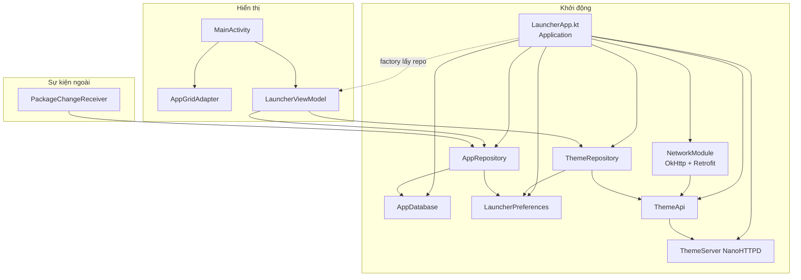
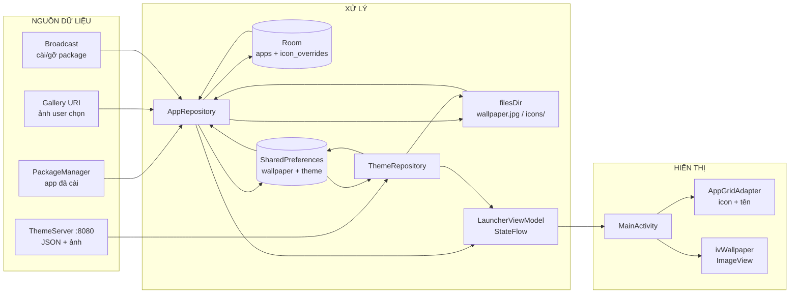
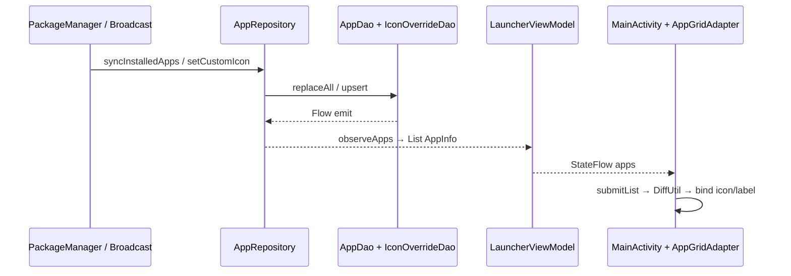
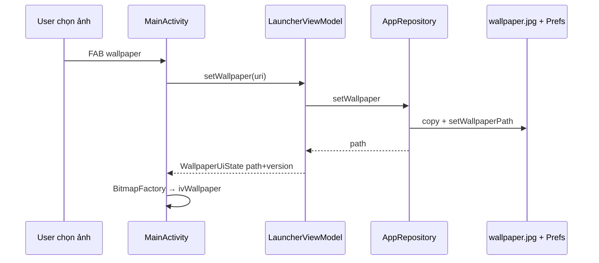
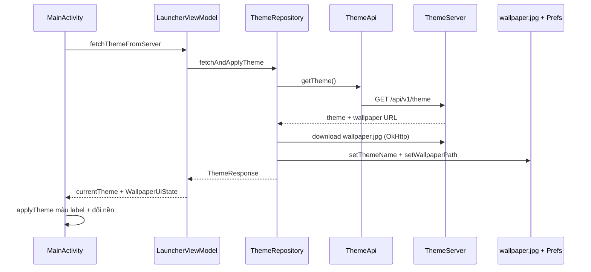

# LauncherAppKotlin

Android Home Launcher viết bằng **Kotlin**, kiến trúc **MVVM** (ViewBinding + Room + StateFlow).

## Tính năng

| Tính năng | Mô tả |
|-----------|--------|
| Home launcher | Đăng ký `HOME` + `DEFAULT`, chặn nút Back |
| Lưới app | Đọc app có `MAIN`/`LAUNCHER`, cache Room, mở app |
| Cài/gỡ realtime | `PackageChangeReceiver` → sync lại Room |
| Đổi wallpaper | Chọn ảnh gallery → lưu `filesDir/wallpaper.jpg` |
| Đổi icon app | Long-press → icon custom theo từng component |
| Theme từ API | NanoHTTPD localhost `:8080` + Retrofit tải theme/wallpaper |

## Chạy thử

1. Sync Gradle → Run trên máy/emulator  
2. Bấm Home → chọn **LauncherAppKotlin** làm màn hình chính  
3. FAB dưới: đổi wallpaper / lấy theme từ server  
4. Long-press app: đổi / reset icon  

---

## Kiến trúc & luồng dữ liệu

```
ui/            View (Activity, Adapter)          ← HIỂN THỊ
viewmodel/     StateFlow + gọi Repository       ← GIỮ STATE / ĐIỀU PHỐI
data/
  local/       Room, SharedPreferences, file    ← LƯU TRỮ
  model/       Model UI / DTO API               ← HÌNH DẠNG DỮ LIỆU
  repository/  Nghiệp vụ                        ← XỬ LÝ / GỘP NGUỒN
  api/         ThemeApi + NetworkModule         ← HỢP ĐỒNG + CẤU HÌNH MẠNG
  remote/      NanoHTTPD mock server            ← NGUỒN GIẢ LẬP
receiver/      Broadcast cài/gỡ app             ← SỰ KIỆN HỆ THỐNG
LauncherApp    Application                      ← TẠO & GHÉP CÁC MẢNH
```

**Lưu ý kỹ thuật (đã xử lý bug refresh):**

- Wallpaper luôn ghi cùng path → dùng `WallpaperUiState(path, version)` để `StateFlow` emit lại.
- Icon custom cũng path cố định → `iconRevision` (= `lastModified`) để DiffUtil biết nội dung đổi.

---

## Sơ đồ quan hệ giữa các file

### 1. Ai tạo ai, ai gọi ai (toàn app)



**Đọc sơ đồ:** `LauncherApp` tạo sẵn DB/repo/API/server → `MainActivity` lấy repo qua factory tạo `ViewModel` → UI chỉ nói chuyện với ViewModel → ViewModel gọi Repository → Repository đụng Room/prefs/file/API.

---

### 2. Dữ liệu lấy từ đâu → xử lý ở đâu → hiện ở đâu



| Tầng | File chính | Việc làm |
|------|------------|----------|
| Nguồn | `PackageManager`, Gallery, `ThemeServer`, Broadcast | Raw data / sự kiện |
| Xử lý + lưu | `*Repository`, Room, Prefs, file | Chuẩn hóa, cache, ghi đĩa |
| State | `LauncherViewModel` | `StateFlow` cho UI observe |
| Hiển thị | `MainActivity`, `AppGridAdapter`, layout XML | Bind lên View |

---

### 3. Ba luồng tính năng (chi tiết file)

#### A. Danh sách app + icon custom



#### B. Wallpaper (gallery)



#### C. Theme từ API



---

## Cấu hình Retrofit / OkHttp (network)

Trước đây chỉ `Retrofit.Builder().baseUrl(...).addConverterFactory(Gson)` trong `LauncherApp` — thiếu timeout, logging, header, tách môi trường.

Hiện tại tách giống app thật:

```
BuildConfig.BASE_URL
        ↓
NetworkModule (OkHttpClient + Retrofit + Gson)
        ↓
ThemeApi (interface)  →  GET api/v1/theme
        ↓
ThemeServer mock :8080  (hoặc backend HTTPS thật)
```

| File | Vai trò |
|------|---------|
| `app/build.gradle.kts` | `buildConfig = true`; `BASE_URL` debug = `http://127.0.0.1:8080/`, release = `https://api.example.com/` |
| `data/api/ApiConfig.kt` | Timeout, tên header, User-Agent |
| `data/api/NetworkModule.kt` | OkHttp (timeout, header interceptor, logging debug) + Retrofit + `themeApi` |
| `data/api/ThemeApi.kt` | `@GET("api/v1/theme")` |
| `data/model/ThemeResponse.kt` | DTO + `@SerializedName` |
| `data/remote/ThemeServer.kt` | Mock `GET /api/v1/theme` + `/wallpaper.jpg` |
| `ImageFileHelper.downloadFromUrl` | Tải ảnh bằng **cùng** `NetworkModule.okHttpClient` |

### `NetworkModule` gồm gì?

| Thành phần | Thực tế dùng để |
|------------|-----------------|
| `connect/read/writeTimeout` | Tránh treo vô hạn khi mạng chậm |
| `headerInterceptor` | `Accept: application/json`, `User-Agent` |
| `HttpLoggingInterceptor` | `BODY` khi `BuildConfig.DEBUG`, `NONE` khi release |
| `retryOnConnectionFailure(true)` | Thử lại khi TCP đứt tạm |
| `GsonConverterFactory` + `setLenient()` | Parse JSON → `ThemeResponse` |
| `BuildConfig.BASE_URL` (phải có `/` cuối) | Đổi môi trường không sửa code gọi API |

### Đổi sang backend thật

1. Sửa `buildConfigField("BASE_URL", ...)` trong `release` (hoặc debug trỏ máy/staging).  
2. Tắt / bỏ start `ThemeServer` nếu không cần mock.  
3. Release dùng **HTTPS** → có thể bỏ `usesCleartextTraffic` (hoặc chỉ giữ cho debug).  
4. Endpoint phải khớp `ThemeApi` (`api/v1/theme`) hoặc sửa path cho đúng backend.

---

## Khi nào dùng gì? (`data class` / `class` / `interface` / …)

Đây là quy ước **đúng với project này** — học thuộc để thêm feature cho “đúng chỗ”.

| Kiểu Kotlin | Dùng khi nào | Ví dụ trong project |
|-------------|--------------|---------------------|
| **`data class`** | Chỉ **mang dữ liệu** (copy, equals, toString hữu ích). Không chứa logic nặng. | `AppInfo`, `ThemeResponse`, `AppEntity`, `IconOverrideEntity`, `WallpaperUiState` |
| **`class`** | Có **hành vi / lifecycle / state** (gọi DAO, copy file, hold Binding, …). | `AppRepository`, `ThemeRepository`, `MainActivity`, `LauncherViewModel`, `LauncherPreferences`, `ThemeServer` |
| **`interface`** | **Hợp đồng** không có body (hoặc default tối thiểu): API Retrofit, DAO Room. Framework generate/impl. | `ThemeApi`, `AppDao`, `IconOverrideDao` |
| **`object`** | Singleton không cần Context trong constructor — tiện ích / network module. | `ImageFileHelper`, `ApiConfig`, `NetworkModule` |
| **`abstract class`** | Base do framework (RoomDatabase) — bạn chỉ khai báo DAO. | `AppDatabase` |
| **`enum` / `sealed class`** | Tập giá trị cố định / state phân nhánh rõ (project chưa dùng nhiều; phù hợp lỗi UI, tab mode, …). | (có thể thêm sau) |

### Nhớ nhanh theo “file thuộc tầng nào”

```
Entity / DTO / UI model     → data class
DAO / Retrofit API          → interface
Repository / ViewModel / UI → class
Helper / Network module     → object
Room Database               → abstract class
```

### `data class` Entity vs Model UI — khác nhau chỗ nào?

| | **Entity** (`AppEntity`) | **Model UI** (`AppInfo`) |
|--|--------------------------|---------------------------|
| Ở đâu | `data/local/entity/` | `data/model/` |
| Mục đích | Lưu Room (cột DB) | Đưa lên Adapter/Activity |
| Có `Drawable`? | **Không** (Room không lưu Drawable) | **Có** (`icon`) |
| Ai map | Repository: `toAppInfo()` | ViewModel/UI dùng trực tiếp |

**Quy tắc:** DB/API gần “thô” → Entity/DTO; gần màn hình → Model UI (có thể thêm field chỉ phục vụ DiffUtil như `iconRevision`).

---

## Checklist: thêm một tính năng tương tự (từng bước)

Giả sử bạn muốn thêm tính năng kiểu **“đổi X, lưu lại, hiện ngay trên launcher”** (giống wallpaper / icon / theme).

### Bước 0 — Phân tích trước khi gõ code

Trả lời 4 câu:

1. **Nguồn data?** Gallery / PackageManager / HTTP / user nhập / Broadcast?  
2. **Lưu ở đâu?**  
   - Prefs: 1 giá trị đơn giản (path, tên theme)  
   - Room: list / quan hệ / observe Flow  
   - File: ảnh, blob  
3. **Ai hiển thị?** ImageView / item trong Adapter / Toast / màu chữ?  
4. **Có cần “version/revision” không?** Nếu ghi đè **cùng path** hoặc DiffUtil dễ bỏ qua → cần bump version giống wallpaper/icon.

---

### Bước 1 — Model dữ liệu (`data class`)

| Tình huống | Tạo file |
|------------|----------|
| Lưu Room | `data/local/entity/XxxEntity.kt` → **`data class`** + `@Entity` |
| Response API | `data/model/XxxResponse.kt` → **`data class`** |
| Đưa lên UI | `data/model/XxxUi.kt` hoặc field mới trên `AppInfo` → **`data class`** |
| StateFlow cần force refresh | `XxxUiState(path, version)` trong ViewModel file → **`data class`** |

---

### Bước 2 — Tầng lưu trữ

| Tình huống | Làm gì | Kiểu |
|------------|--------|------|
| Bảng Room mới | `XxxDao.kt` | **`interface`** + `@Dao` |
| | Đăng ký entity trong `AppDatabase`, **tăng version + Migration** | `abstract class` đã có |
| Prefs key mới | Thêm get/set trong `LauncherPreferences` | `class` |
| File ảnh | Dùng / mở rộng `ImageFileHelper` | `object` |

---

### Bước 3 — Nguồn ngoài (nếu có)

| Tình huống | File | Kiểu |
|------------|------|------|
| API HTTP | `data/api/XxxApi.kt` | **`interface`** Retrofit |
| Mock server | Sửa `ThemeServer` hoặc `XxxServer.kt` | **`class`** |
| Sự kiện hệ thống | `receiver/XxxReceiver.kt` + Manifest | **`class`** `: BroadcastReceiver` |

---

### Bước 4 — Repository (`class`) — xử lý nghiệp vụ

- Thêm hàm vào `AppRepository` / `ThemeRepository` **hoặc** tạo `XxxRepository.kt` nếu domain tách biệt.  
- Repository **gộp** nguồn → lưu → trả model UI / `Result` / `Flow`.  
- **Không** đụng View trực tiếp.

Ví dụ khung:

```kotlin
class XxxRepository(
    private val dao: XxxDao,          // hoặc prefs / api
    private val context: Context
) {
    fun observe(): Flow<List<XxxUi>> = ...
    suspend fun save(input: Uri): Boolean = ...
}
```

---

### Bước 5 — Wiring trong `LauncherApp` (`class` Application)

- Lazy tạo repository mới.  
- Truyền vào `LauncherViewModelFactory` nếu ViewModel cần.

---

### Bước 6 — ViewModel (`class`) — state cho UI

1. Thêm `MutableStateFlow` / expose `StateFlow`.  
2. Hàm public: `setXxx(...)`, `loadXxx()`, … gọi repository trong `viewModelScope.launch`.  
3. Nếu value có thể **trùng** (cùng path/string) → bump `version` trong `data class` state.  
4. Cập nhật `LauncherViewModelFactory.create`.

---

### Bước 7 — UI hiển thị

| Việc | File |
|------|------|
| Nút / vùng tương tác | `res/layout/activity_main.xml` (+ `strings.xml`) |
| Click → gọi ViewModel | `MainActivity.kt` |
| Item list đổi | `AppGridAdapter` + **DiffUtil** so đúng field đổi |
| Collect Flow | `repeatOnLifecycle(STARTED) { viewModel.xxx.collect { ... } }` |

---

### Bước 8 — Manifest / permission (nếu cần)

- Permission (`INTERNET`, …)  
- `<receiver>` / `<queries>`  
- Không quên `exported`, `scheme`, …

---

### Bước 9 — Kiểm tra refresh UI

- Đổi **lần 1** và **lần 2** liên tiếp (bug hay gặp).  
- Room Flow có emit không?  
- `StateFlow` có bị equal-skip không?  
- DiffUtil `areContentsTheSame` có so field thay đổi không?

---

## Ví dụ áp dụng: “Thêm tính năng Đổi font chữ label app”

Làm lần lượt đúng checklist:

| Bước | File | Kiểu / việc |
|------|------|-------------|
| 1 | `LauncherPreferences` | Thêm `getLabelFont()` / `setLabelFont()` |
| 2 | (không cần Entity nếu chỉ 1 lựa chọn global) | Prefs đủ |
| 3 | `LauncherViewModel` | `data class` không bắt buộc; `StateFlow<String?>` font name + `setLabelFont()` |
| 4 | `MainActivity` | Nút chọn font → `viewModel.setLabelFont` → collect → `adapter.setLabelFont` |
| 5 | `AppGridAdapter` | `class`: giữ `typeface`, `setLabelFont`, bind trong `onBindViewHolder` |
| 6 | `strings.xml` / layout | Label nút |

Nếu font **theo từng app** (giống icon): lúc đó mới cần `data class FontOverrideEntity` + `interface FontOverrideDao` + map trong `AppRepository.observeApps` + field trên `AppInfo` + DiffUtil.

---

## Bản đồ quyết định nhanh (một trang)

```
Có dữ liệu mới?
  ├─ Chỉ mang field, equals/copy hữu ích     → data class (model/entity/state)
  ├─ Cần hàm xử lý, giữ deps, lifecycle      → class (Repo / VM / Activity)
  ├─ Room query hoặc Retrofit endpoint       → interface
  ├─ Helper thuần, 1 instance toàn app       → object
  └─ Bảng Room + DAO mới                     → Entity data class + Dao interface
                                              + AppDatabase version++ + Migration

Hiển thị?
  └─ Collect StateFlow ở Activity/Fragment
      └─ List? → Adapter + DiffUtil so đúng field đổi
      └─ Ảnh path cố định? → version/revision khi publish
```

---


## Cấu trúc thư mục — để làm gì?

```
LauncherAppKotlin/
├── README.md                          # Tài liệu project (file này)
├── CODE_GUIDE.md                      # Ghi chú chi tiết / roadmap nội bộ
├── build.gradle.kts                   # Gradle root
├── settings.gradle.kts                # Tên module, plugin management
├── gradle/
│   ├── libs.versions.toml             # Version catalog (Room, Retrofit, …)
│   └── wrapper/                       # Gradle Wrapper
└── app/                               # Module Android chính
    ├── build.gradle.kts               # SDK, ViewBinding, dependencies
    ├── proguard-rules.pro             # ProGuard (release)
    └── src/main/
        ├── AndroidManifest.xml        # HOME, permission, receiver, Application
        ├── java/com/example/launcherappkotlin/
        │   ├── LauncherApp.kt         # Application — DI thủ công
        │   ├── ui/launcher/           # Màn hình launcher
        │   ├── viewmodel/             # ViewModel + factory
        │   ├── data/
        │   │   ├── api/               # ThemeApi, NetworkModule, ApiConfig
        │   │   ├── remote/            # Mock HTTP server (NanoHTTPD)
        │   │   ├── local/             # Room, prefs, file helper
        │   │   │   ├── dao/           # Truy vấn Room
        │   │   │   └── entity/        # Bảng Room
        │   │   ├── model/             # Model UI / response
        │   │   └── repository/        # Logic nghiệp vụ
        │   └── receiver/              # BroadcastReceiver
        └── res/
            ├── layout/                # XML layout
            ├── values/                # string, color, theme
            ├── drawable/, mipmap-/    # Icon app
            └── xml/                   # Backup / data extraction rules
```

| Thư mục | Vai trò |
|---------|---------|
| `ui/launcher/` | UI: Activity + RecyclerView adapter |
| `viewmodel/` | Giữ state, gọi repository, expose `StateFlow` |
| `data/local/` | Lưu trữ cục bộ (Room, SharedPreferences, file ảnh) |
| `data/local/dao/` | Interface truy vấn Room |
| `data/local/entity/` | Định nghĩa bảng Room |
| `data/model/` | Model đưa lên UI / parse JSON |
| `data/repository/` | Gộp nguồn dữ liệu, xử lý nghiệp vụ |
| `data/api/` | `ThemeApi` + `NetworkModule` + `ApiConfig` (OkHttp/Retrofit) |
| `data/remote/` | Server demo chạy trong app |
| `receiver/` | Lắng nghe sự kiện hệ thống (cài/gỡ package) |
| `res/layout/` | Giao diện XML → sinh ViewBinding |

---

## Từng file & từng hàm

### `LauncherApp.kt`

`Application` — tạo dependency dùng chung, start mock theme server khi process chạy.

| Thành viên | Mô tả |
|------------|--------|
| `database` | Lazy singleton Room `AppDatabase` |
| `preferences` | Lazy `LauncherPreferences` |
| `themeServer` | NanoHTTPD port 8080 (private) |
| `themeApi` | Lazy từ `NetworkModule.themeApi` |
| `themeRepository` | Lazy `ThemeRepository` |
| `appRepository` | Lazy `AppRepository` (DAO + PackageManager + prefs) |
| `onCreate()` | `super.onCreate()` rồi `ThemeServer.start(...)` |

---

### `data/api/ApiConfig.kt`

`object` — hằng số network dùng chung.

| Thành viên | Mô tả |
|------------|--------|
| `CONNECT_TIMEOUT_SEC` / `READ_*` / `WRITE_*` | Timeout OkHttp (giây) |
| `HEADER_*` / `MEDIA_TYPE_JSON` / `USER_AGENT` | Tên header & giá trị mặc định |

---

### `data/api/NetworkModule.kt`

`object` — tạo OkHttp + Retrofit + API (một chỗ cấu hình mạng).

| Thành viên | Mô tả |
|------------|--------|
| `gson` | `GsonBuilder().setLenient()` |
| `headerInterceptor` | Gắn `Accept` + `User-Agent` mọi request |
| `loggingInterceptor` | Log BODY (debug) / NONE (release) |
| `okHttpClient` | Client dùng chung (Retrofit + download ảnh) |
| `retrofit` | `baseUrl = BuildConfig.BASE_URL` + Gson converter |
| `create<T>()` | `retrofit.create` generic |
| `themeApi` | Lazy `ThemeApi` |

---
### `ui/launcher/MainActivity.kt`

Màn HOME: lưới app, wallpaper, đổi theme, đổi icon.

| Thành viên | Mô tả |
|------------|--------|
| `binding` | `ActivityMainBinding` |
| `adapter` | `AppGridAdapter` |
| `pendingIconApp` | App đang chờ URI sau khi chọn “Đổi icon” |
| `viewModel` | `LauncherViewModel` qua factory |
| `pickWallpaper` | `GetContent("image/*")` → `setWallpaper` |
| `pickIcon` | `GetContent` → `setCustomIcon` nếu có `pendingIconApp` |
| `onCreate(...)` | Edge-to-edge, nuốt Back, grid 4 cột, FAB, `collect` `apps` / `wallpaper` / `currentTheme` |
| `showIconOptions(app)` | Dialog: đổi icon / reset / hủy |
| `openApp(app)` | `getLaunchIntentForPackage` → `startActivity` |
| `applyTheme(theme)` | Đặt màu label (`winter` / `summer` / trắng) |

---

### `ui/launcher/AppGridAdapter.kt`

`ListAdapter` hiển thị từng ô app (icon + tên).

| Thành viên | Mô tả |
|------------|--------|
| `onClick` / `onLongClick` | Callback tap / long-press |
| `AppViewHolder` | Giữ `ItemAppBinding` |
| `onCreateViewHolder(...)` | Inflate `item_app.xml` |
| `onBindViewHolder(...)` | Gán icon, label, listener, màu chữ |
| `DiffCallback.areItemsTheSame` | Cùng `packageName` + `activityName` |
| `DiffCallback.areContentsTheSame` | So `label`, `hasCustomIcon`, **`iconRevision`** |
| `setLabelColor(color)` | Đổi màu nhãn + `notifyDataSetChanged()` |

---

### `viewmodel/LauncherViewModel.kt`

State UI + gọi repository.

#### `WallpaperUiState`

| Property | Mô tả |
|----------|--------|
| `path` | Path file wallpaper (`null` = chưa có) |
| `version` | Bump mỗi lần publish để Force UI reload dù path giống |

#### `LauncherViewModel`

| Thành viên | Mô tả |
|------------|--------|
| `apps` | `StateFlow<List<AppInfo>>` từ `observeApps().stateIn(...)` |
| `wallpaper` | `StateFlow<WallpaperUiState>` |
| `currentTheme` | `StateFlow<String?>` tên theme |
| `init` | Load wallpaper + theme; `syncInstalledApps()` nền |
| `setWallpaper(uri)` | Lưu wallpaper → `publishWallpaper` |
| `setCustomIcon(componentKey, uri)` | Ghi icon custom |
| `clearCustomIcon(componentKey)` | Xóa icon custom |
| `fetchThemeFromServer()` | Gọi API theme → cập nhật theme + wallpaper |
| `publishWallpaper(path)` | Gán `WallpaperUiState(path, nanoTime())` |

#### `LauncherViewModelFactory`

| Thành viên | Mô tả |
|------------|--------|
| `create(modelClass)` | Tạo `LauncherViewModel` hoặc throw |

---

### `data/repository/AppRepository.kt`

Nghiệp vụ danh sách app, wallpaper gallery, icon override, sync PackageManager ↔ Room.

| Hàm | Mô tả |
|-----|--------|
| `observeApps()` | `combine` Room apps + icon overrides → `Flow<List<AppInfo>>` |
| `getWallpaperPath()` | Đọc path wallpaper từ prefs |
| `setWallpaper(uri)` | Copy → `filesDir/wallpaper.jpg`, lưu prefs; trả `Boolean` |
| `setCustomIcon(componentKey, uri)` | Copy → `icons/{safeKey}.jpg`, touch mtime, upsert Room |
| `clearCustomIcon(componentKey)` | Xóa row Room + file icon |
| `syncInstalledApps()` | Query hệ thống → `appDao.replaceAll` |
| `queryLauncherApps()` | Private: `MAIN` + `LAUNCHER` → `List<AppEntity>` |
| `AppEntity.toAppInfo(override)` | Private: ưu tiên icon custom; gắn `iconRevision` |

---

### `data/repository/ThemeRepository.kt`

Lấy theme từ API, tải wallpaper, lưu prefs.

| Hàm | Mô tả |
|-----|--------|
| `getCurrentTheme()` | Tên theme đã lưu |
| `fetchAndApplyTheme()` | GET `/api/v1/theme` → lưu tên → download wallpaper (OkHttp) → lưu path; `Result<ThemeResponse>` |

---

### `data/model/AppInfo.kt`

Model một app trên lưới UI.

| Property | Mô tả |
|----------|--------|
| `label` | Tên hiển thị |
| `packageName` | Package Android |
| `activityName` | Activity launcher |
| `icon` | `Drawable` (custom hoặc hệ thống) |
| `componentKey` | `"package/activity"` |
| `hasCustomIcon` | Có icon override không |
| `iconRevision` | `lastModified` file icon — DiffUtil dùng để refresh |

---

### `data/model/ThemeResponse.kt`

DTO JSON từ `GET /api/v1/theme` (`@SerializedName` khớp key server).

| Property | Mô tả |
|----------|--------|
| `theme` | Tên theme (vd. `"summer"`) |
| `wallpaper` | URL ảnh nền |

---

### `data/api/ThemeApi.kt`

Retrofit interface (hợp đồng HTTP).

| Hàm | Mô tả |
|-----|--------|
| `getTheme()` | `@GET("api/v1/theme")` → `ThemeResponse` |

---

### `data/remote/ThemeServer.kt`

Mock HTTP server (NanoHTTPD) port **8080**.

| Hàm | Mô tả |
|-----|--------|
| `serve(session)` | `/api/v1/theme` → JSON summer; `/wallpaper.jpg` → JPEG demo; else 404 |

---

### `data/local/LauncherPreferences.kt`

SharedPreferences: path wallpaper + tên theme.

| Hàm | Mô tả |
|-----|--------|
| `getWallpaperPath()` / `setWallpaperPath(path)` | Đọc/ghi `wallpaper_path` |
| `getThemeName()` / `setThemeName(name)` | Đọc/ghi `theme_name` |

---

### `data/local/ImageFileHelper.kt`

Tiện ích file ảnh (object singleton).

| Hàm | Mô tả |
|-----|--------|
| `copyToInternal(context, uri, dest)` | Copy URI gallery → file nội bộ |
| `loadDrawable(context, path)` | File → `BitmapDrawable?` |
| `downloadFromUrl(url, dest)` | Tải HTTP URL → file qua `NetworkModule.okHttpClient` |

---

### `data/local/AppDatabase.kt`

Room database version **2** (`launcher.db`).

| Thành viên | Mô tả |
|------------|--------|
| `appDao()` | Accessor `AppDao` |
| `iconOverrideDao()` | Accessor `IconOverrideDao` |
| `MIGRATION_1_2` | Tạo bảng `icon_overrides` |
| `getInstance(context)` | Singleton builder + migration |

---

### `data/local/entity/AppEntity.kt`

Bảng `installed_apps`.

| Cột | Mô tả |
|-----|--------|
| `componentKey` (PK) | `"package/activity"` |
| `packageName` | Package |
| `activityName` | Activity |
| `label` | Tên app |

---

### `data/local/entity/IconOverrideEntity.kt`

Bảng `icon_overrides`.

| Cột | Mô tả |
|-----|--------|
| `componentKey` (PK) | Key component app |
| `iconPath` | Path file icon custom |

---

### `data/local/dao/AppDao.kt`

| Hàm | Mô tả |
|-----|--------|
| `observeAll()` | `Flow` mọi app, sort label (NOCASE) |
| `insertAll(apps)` | Insert `REPLACE` |
| `deleteAll()` | Xóa hết |
| `replaceAll(apps)` | Transaction: delete + insert |

---

### `data/local/dao/IconOverrideDao.kt`

| Hàm | Mô tả |
|-----|--------|
| `observeAll()` | `Flow` mọi icon override |
| `upsert(override)` | Insert `REPLACE` theo `componentKey` |
| `delete(componentKey)` | Xóa override một app |

---

### `receiver/PackageChangeReceiver.kt`

| Hàm | Mô tả |
|-----|--------|
| `onReceive(context, intent)` | `PACKAGE_ADDED` / `REMOVED` / `REPLACED` → `syncInstalledApps()` trên IO |

---

## Tài nguyên & Manifest

### `AndroidManifest.xml`

| Mục | Vai trò |
|-----|---------|
| `INTERNET` | HTTP (Retrofit + download wallpaper) |
| `<queries>` MAIN/LAUNCHER | Android 11+: `queryIntentActivities` thấy đủ app |
| `android:name=".LauncherApp"` | Dùng custom `Application` |
| `usesCleartextTraffic="true"` | Cho phép HTTP `127.0.0.1` |
| `MainActivity` + HOME/DEFAULT/LAUNCHER | Là Home + hiện icon; `singleTask` |
| `PackageChangeReceiver` | Lắng nghe cài/gỡ/cập nhật package |

### Layout / values

| File | Vai trò |
|------|---------|
| `res/layout/activity_main.xml` | `ivWallpaper`, `rvApps`, `fabWallpaper`, `fabTheme` |
| `res/layout/item_app.xml` | Một ô: `ivIcon` + `tvLabel` |
| `res/values/strings.xml` | Chuỗi UI (wallpaper, icon, theme, …) |
| `res/values/colors.xml` | Nền launcher, màu label summer/winter |
| `res/values/themes.xml` | Theme Material3 app |

### Build

| File | Vai trò |
|------|---------|
| `app/build.gradle.kts` | ViewBinding, BuildConfig, `BASE_URL`, Room/KSP, OkHttp, Retrofit, NanoHTTPD |
| `gradle/libs.versions.toml` | Version: Room, OkHttp, Retrofit, … |

---

## Luồng nghiệp vụ chính

### Mở launcher / danh sách app

```
MainActivity.onCreate
  → ViewModel.init → syncInstalledApps → Room
  → observeApps (Room + icon_overrides) → StateFlow apps
  → Adapter.submitList → bind icon/label
  → tap → openApp
```

### Cài / gỡ app

```
PackageChangeReceiver
  → AppRepository.syncInstalledApps
  → Room đổi → Flow emit → UI cập nhật
```

### Đổi wallpaper

```
FAB wallpaper → GetContent
  → setWallpaper → copy wallpaper.jpg + prefs
  → publishWallpaper(path, version++) → ImageView decode lại
```

### Đổi icon

```
Long-press → chọn ảnh
  → setCustomIcon → icons/{key}.jpg + touch mtime + Room upsert
  → observeApps → AppInfo.iconRevision đổi
  → DiffUtil rebind ô đó
```

### Theme từ server

```
FAB theme
  → ThemeRepository.fetchAndApplyTheme
  → NetworkModule → GET /api/v1/theme (ThemeServer)
  → download wallpaper (OkHttp) → prefs + file
  → currentTheme + publishWallpaper(version++)
  → applyTheme (màu label) + đổi nền
```

---

## Điểm cần nhớ khi chạy

1. **Chọn làm Home mặc định** thì mới thấy đúng trải nghiệm launcher.  
2. Theme server chỉ sống khi process app còn chạy (start trong `LauncherApp.onCreate`).  
3. ViewBinding bật trong `app/build.gradle.kts` — **không** sửa file trong `app/build/generated/`.  
4. Android 11+: thiếu `<queries>` thì list app có thể thiếu/rỗng.  
5. Network: debug log HTTP trong Logcat (`OkHttp`); đổi `BuildConfig.BASE_URL` khi trỏ server thật.
